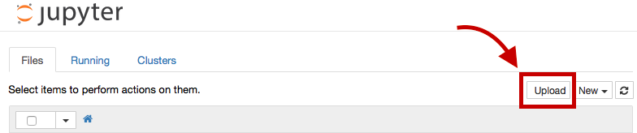

#  Spark Lab 1

### Virtual Machine Required
Note: This lab requiress additional prep in order to run successfully:

1. [Download and install Virtual Machine](../VM-installation.md).
    - Note: This is a big file. Please reserve time to download and troubleshoot installation.

## Introduction
In this lab, we will use Spark to process the Bay Area Bikeshare data. We will explore both the streaming and the sql APIs for Spark in order to investigate regional bike share usage habits.

We will do this using the Virtual Machine we created earlier this week. The first steps to get started are:
    
    cd dsi-bigdata-vm
    vagrant up
    vagrant ssh

And then, once inside, run:

    spark_local_start.sh

**Important:** If your machine is already running and you've started the Hadoop services with `bigdata_start.sh`, you may want to first run `bigdata_stop.sh` to stop all services and free some memory space.

Once you've started spark in local mode, you should be able to access Jupyter at this address:

http://10.211.55.101:18888

In order to run the starter code on the VM, you will need to upload it using the Jupyter browser upload function.

## Exercise

#### Requirements

- parse data: split csv lines
- filter: for Caltrain station
- Spark Map Reduce: Find out number of trips per hour and per day
    - trips by day - hour (mapper)
    - trips by day - hour (reducer)
- Spark Map Reduce: Find out number of trips per hour
    - trips by hour (mapper)
    - trips by hour (reducer)
- collect!

**Bonus:**
- Repeat the task using Spark SQL

#### Starter code

[Starter Code](./assets/code/starter-code/starter-code.ipynb)

### Additional Resources

- [Spark CSV](https://github.com/databricks/spark-csv)
- [Pyspark programming guide](https://spark.apache.org/docs/0.9.0/python-programming-guide.html)
- [Download and run Spark](https://github.com/mahmoudparsian/pyspark-tutorial/blob/master/howto/download_install_run_spark.md)
